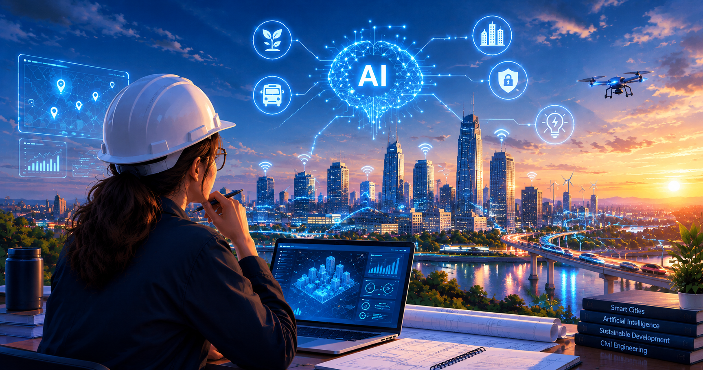

# 👋 Hey, I'm Ahlem Ben Ali

## 🌆 About Me

I'm a **Civil Engineering student at ENSIT** (Tunis), fascinated by what happens when structural engineering meets artificial intelligence. My work spans reinforced concrete design, steel structures, and BIM — and lately, teaching machines to think about carbon footprints and smart infrastructure.

🏗️ Designing & analyzing structures per **Eurocode 2 & 3** &nbsp;|&nbsp; 🧠 Building **AI-powered dashboards** for sustainability & carbon tracking &nbsp;|&nbsp; 🌐 Passionate about **Digital Twins**, **BIM**, and the future of smart cities &nbsp;|&nbsp; 🎤 **President**, IEEE ENSIT Student Branch &nbsp;|&nbsp; 🌍 Arabic (native) · French & English (fluent) · German (fluent)

## 📊 GitHub Stats

## 🏗️ The Crane That Ate My Commits 🐍

## 🧰 Tech Stack

**🏗️ Structural Engineering & BIM**
 

**🤖 AI, Machine Learning & Data**
 

**🎨 Design & UI/UX**
 

**🖥️ Office & Productivity**
 

## 🧭 My Journey

<table>
<tr>
<td width="50%" valign="top">

### 🎓 Current
- **Engineering Degree — Civil Engineering**, ENSIT, Tunis *(in progress)*
- **President**, IEEE ENSIT Student Branch *(2024 – Present)*

### 🎓 Education
- Engineering Degree, Civil Engineering — ENSIT, Tunis
- Preparatory Classes, PC track — IPEIEM, Tunis
- High School Diploma, Sciences (Honors) — Lycée Nouvelle Médina Ben Arous

</td>
<td width="50%" valign="top">

### 🏗️ Key Projects
- **Final Year Project** (Hammamet) — RC building design per EC2, modeled in Robot Structural Analysis
- **R+2 Building** — AutoCAD, ARCHE Ossature, load distribution & rebar design
- **22×60 m Steel Hangar** (Tabarka) — S235 steel, Eurocode 3, bolted connections
- **Olive Crate Storage Depot** — Steel structure design & modeling for an olive crate warehouse, Robot Structural Analysis & Tekla Structures
- **Refinery Structure Project** — Structural design & 3D modeling of an industrial refinery framework, Robot Structural Analysis & Tekla Structures
- **BIM & Digital Transformation** — BIM / AI / Digital Twins synergies

</td>
</tr>
</table>

## 🌱 Smart City & AI Projects

<table>
<tr>
<td width="50%" valign="top">

**🌍 ECO DATA**
 
*ENSIT GreenTech Challenge 2026*
 
Campus carbon-intelligence platform — an interactive dashboard analyzing emissions and supporting decision-making toward net-zero campuses.
 
[📄 Read the report](https://docs.google.com/document/d/1wWhg6cqHTTAKNj04InGRU3kyPqiMtg9J1Gw3Efd0FN4/edit?usp=sharing)
</td>
<td width="50%" valign="top">

**🎓 NeuroLearn**
 
*IEEE Education Week Challenge*
 
An AI-powered EdTech platform bringing smart, adaptive learning experiences to students.
 
[📄 Read the report](https://docs.google.com/document/d/1lbMhTOjmUs4lbwCkZSr70GJMIhLGT-Q8fuF-fGYzTmo/edit?usp=sharing)
</td>
</tr>
<tr>
<td width="50%" valign="top">

**⚡ CAS — Energy Transition & Renewable Management**
 
*TSYP 14*
 
A study addressing Tunisia's energy transition, tackling the country's growing struggle to manage renewable energy and reduce dependence on imported fossil fuels.
 
[📄 Read the report](https://docs.google.com/document/d/1WCR2XRtI4gbWfnYiZyNE0B7dOp34LZa3vNW_mvdNC5I/edit?usp=sharing)

</td>
<td width="50%" valign="top">

**💧 HydroFirma**
 
*SIGHT, TEMS & SSIT Challenge, TSYP 13 — 🥉 3rd place* &nbsp;·&nbsp; *2026 IEEE Region 8 Humanitarian Technology Hackathon — 🥉 3rd place*
 
An integrated smart hydroponics platform tackling water scarcity, soil degradation, pest infestations, and energy constraints in Tunisian agriculture.
 
[📄 Read the report](https://docs.google.com/document/d/1E--_c339hVKg86zPr1cTADDsWLIhWTPVfICL-2gAkjo/edit?usp=sharing)

</td>
</tr>
<tr>
<td width="50%" valign="top">

**🔬 ResearchPal — From Answer Engine to Pedagogical Scaffold**
 
*IEEE Education Week 2026, Tunisia Section*
 
An AI-powered research coaching platform designed to guide young learners (ages 8–15) toward genuine understanding rather than copy-paste answers.
 
[📄 Read the technical report](https://docs.google.com/document/d/1SZS6KDWGdkataHzbKR4djbYaQkqWdMsd/edit?usp=sharing)

</td>
<td width="50%" valign="top">

</td>
</tr>
</table>

## 🏆 Certifications & Events

`Civil Engineering Structures Day — JOA'25` `Tunisia Digital Summit TDS 9 (BIM & Smart Cities)` `FAO — Using Land Cover Information to Track SDG Progress` `FAO — Climate Risk Management through Social Protection` `SDG 15` `TSYP 12 & 13`

**💻 IEEE Xtreme** — 24-hour competitive programming competition

**🤖 Robotics Competitions**
 
`AeroFab 1.0` `Tout Terrain`

## 🎤 Speaking & Recognition

- 🎗️ **Attestation of Honor** — Higher National Engineering School of Tunis (ENSIT), End-of-Year Ceremony
- 🎙️ **Speaker, Civil Engineering Session** — Engineering Schools Entrance Forum *(2nd year)*
- 🎙️ **Speaker, Choufli FAC — Session 2** *("Find Your Path, Shape Your Future")* — Orientation initiative bringing together students from 9+ universities *(3rd year)*

## 🙎‍♀️ Leadership & Activities

- 🏆 **President** — IEEE ENSIT Student Branch, Tunisia Section *(2024 – Present)*
  - Coordinated a team of volunteers and organized events
  - Managed relationships with members, partners, and participants
  - Handled administrative follow-up and communication with stakeholders
- 📣 **Digital Communication Officer** — IEEE ENSIT Student Branch
  - Managed social media (Facebook, Instagram, LinkedIn)
  - Created promotional content and monitored online communication

**IEEE Awards**
 
🥇 1st place — RAS & VTS Challenge, TSYP 13 &nbsp;|&nbsp; 🥉 3rd place — SIGHT, TEMS & SSIT Challenge, TSYP 13 &nbsp;|&nbsp; 🥉 3rd place — 2026 IEEE Region 8 Humanitarian Technology Hackathon (HydroFirma) &nbsp;|&nbsp; 🏆 Most Outstanding Student Branch (Large Category) — TSYP 12

### 🤝 Let's Connect

❤️ Thanks for stopping by — building smarter cities, one commit at a time.

